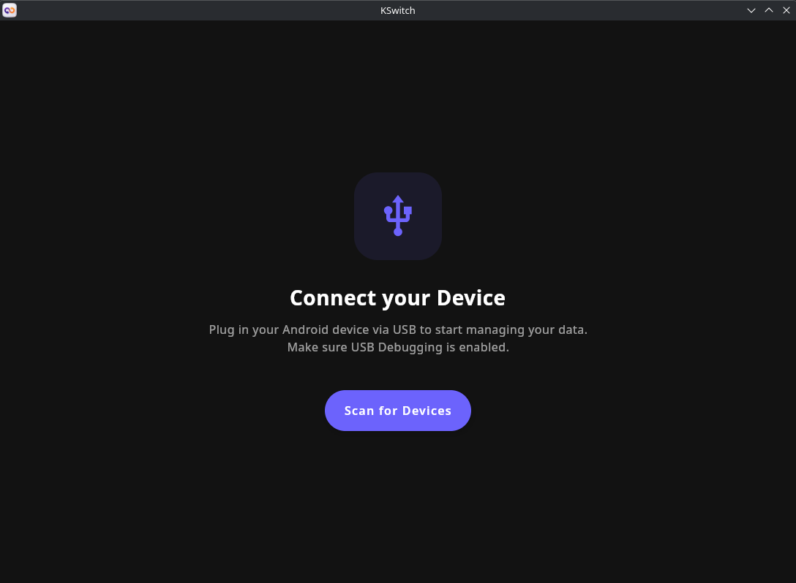
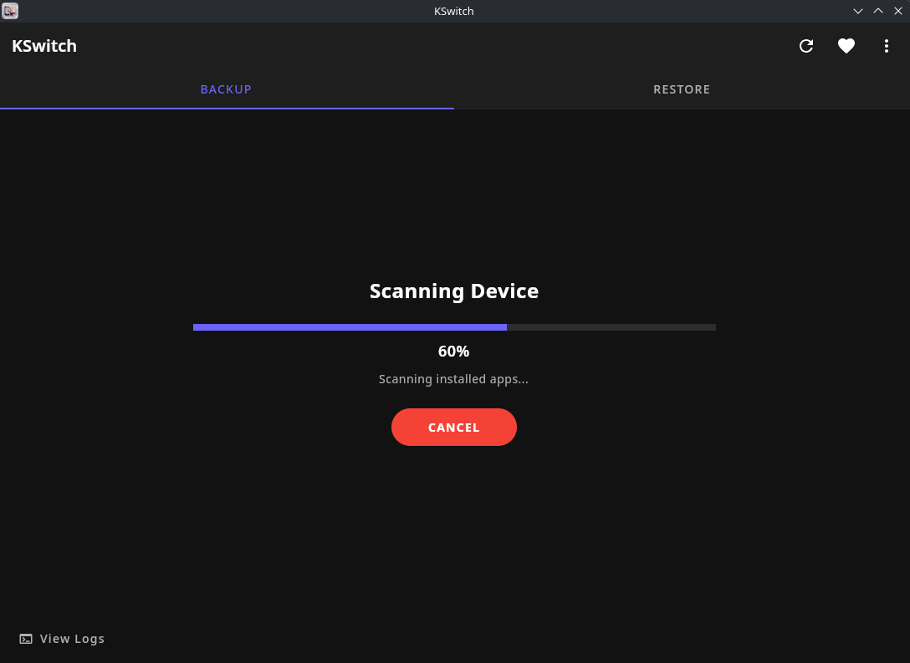
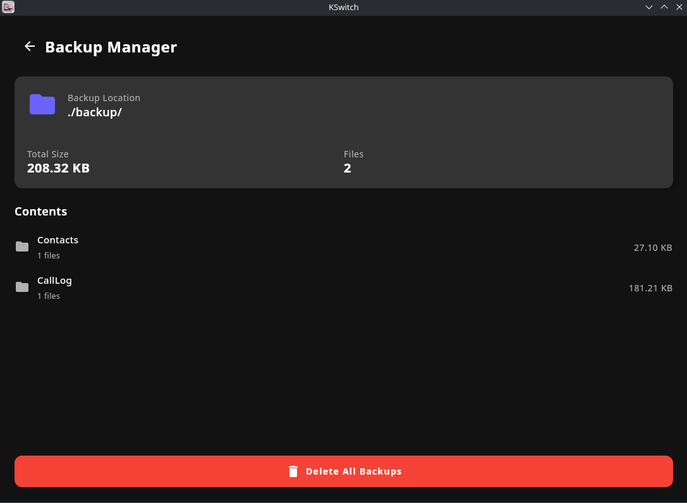

<h1 align="center">KSwitch</h1>

  
  
  
  
  

  <b>The Native, Open-Source Smart Switch Alternative for Linux.</b> 
  <i>Backup & Restore your Samsung/Android devices without Wine, VMs, or privacy concerns.</i>

  <a href="https://github.com/Zyren-Lab/KSwitch/issues">🐛 Report Bug</a>
  •
  <a href="https://github.com/Zyren-Lab/KSwitch/discussions">🚀 Discussions</a>

# What is KSwitch?
**KSwitch** is a native desktop application designed to bridge the gap between Android devices and Linux desktops. While Windows and macOS users enjoy official tools like Samsung Smart Switch™, Linux users are often left behind.

KSwitch solves this by providing a **GUI-based**, lightweight, and privacy-focused backup solution built with **Kotlin Compose Multiplatform**.

Unlike other tools, KSwitch is **Agentless**: it works purely via ADB (Android Debug Bridge) and does not require installing any suspicious APKs on your phone. It uses advanced internal queries to replicate the "Smart Switch" experience — categorizing your data, preserving directory structures, and backing up installed applications.

# Features

### Core Capabilities:
- **🐧 Linux Native:** Built for KDE/GNOME. No Wine, No Electron, No Heavy VMs.
- **⚡ Smart Scanning Engine:** Uses direct `ContentProvider` queries (like the official tool) to find media in milliseconds, skipping recursive folder scanning.
- **🔌 Agentless Architecture:** Just enable USB Debugging. No root required.
- **📂 Structure Preservation:** Mirrors your phone's directory tree exactly on your PC for easy manual access.
- **📝 Manifest System:** Generates a `backup_manifest.json` for every session, tracking every file transfer for reliability.
- **🌗 Dark Mode:** Professional UI designed for modern Linux environments.

### Backup & Restore Support:
- **🖼️ Media:** Images, Videos, and Music (Categorized).
- **📱 Installed Apps:** Automatically extracts and backs up `.apk` (installer) files of user apps.
- **📦 Archives & Docs:** Smart detection for `.zip`, `.rar`, `.pdf`, `.docx` and more.
- **👥 Contacts:** Exports phone contacts to standard `.vcf` format.
- **📞 Call Logs:** Dumps call history to `.xml` for safekeeping (Backup only).

# Screenshots

  
    
    

# 🔮 Roadmap & Future Plans
KSwitch is just getting started! Since the project is built with **Kotlin Multiplatform**, expanding to other OSs is the next logical step.

Here is what I am working on:
- [ ] **Cross-Platform Support:** Native versions for **Windows** and **macOS**.
- [ ] **Wireless Transfer:** Backup over Wi-Fi (no cable needed).
- [ ] **UI/UX Overhaul:** More fluid animations and deeper customization.
- [ ] **Incremental Backup:** Backup only new or changed files to save time.

> **Note:** Porting to other platforms and adding complex features takes time and resources. Your support accelerates this process!

# Installation

### Debian / Ubuntu / Linux Mint and others
Download the latest `.deb` from the [Releases Page](https://github.com/Zyren-Lab/KSwitch/releases).

- `sudo apt update`
- `sudo apt install adb`
- `sudo dpkg -i kswitch_1.0.0-1_amd64.deb`

### Fedora / RedHat / CentOS and others
Download the latest `.rpm` from the [Releases Page](https://github.com/Zyren-Lab/KSwitch/releases).

- `sudo dnf install android-tools`
- `sudo rpm -i kswitch-1.0.0-1.x86_64.rpm`

### Prerequisites
Enable Developer Options on your phone.
Enable USB Debugging.
Connect via USB and allow the RSA fingerprint on your phone screen.
Licensing
This project is licensed under the terms of the GNU General Public License v3.0.
You are free to use, modify, and distribute this software, provided that any derivative works remain open-source under the same license.

External dependencies are used under their respective licenses:

- Kotlin: Apache 2.0
- Compose Multiplatform: Apache 2.0
- ADB (Android Debug Bridge): Apache 2.0 (Google)

Support the Development
KSwitch is developed by a solo developer to make the ecosystem better for everyone.
Building native tools for Linux (and soon Windows/Mac) requires significant time and effort.

If you want to see the Windows/Mac versions sooner, or if this tool saved your data, consider buying me a coffee! It keeps the code flowing. ☕

## ⚖️ Disclaimer
**KSwitch** is an independent, open-source project and is **not** affiliated with, endorsed by, or connected to **Samsung Electronics Co., Ltd.** in any way.

"Samsung" and "Smart Switch" are registered trademarks of Samsung Electronics Co., Ltd.
This tool is built using standard ADB (Android Debug Bridge) protocols provided by Google.

## Credits
A special thanks to the open-source community:

JetBrains for the amazing Kotlin & Compose Multiplatform.
Google for the Android Debug Bridge documentation.
Linux Community for the inspiration and support.

## Star History

